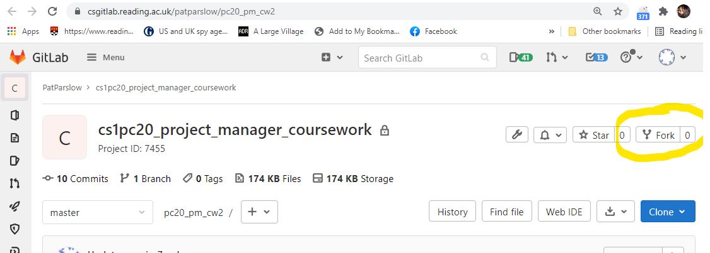
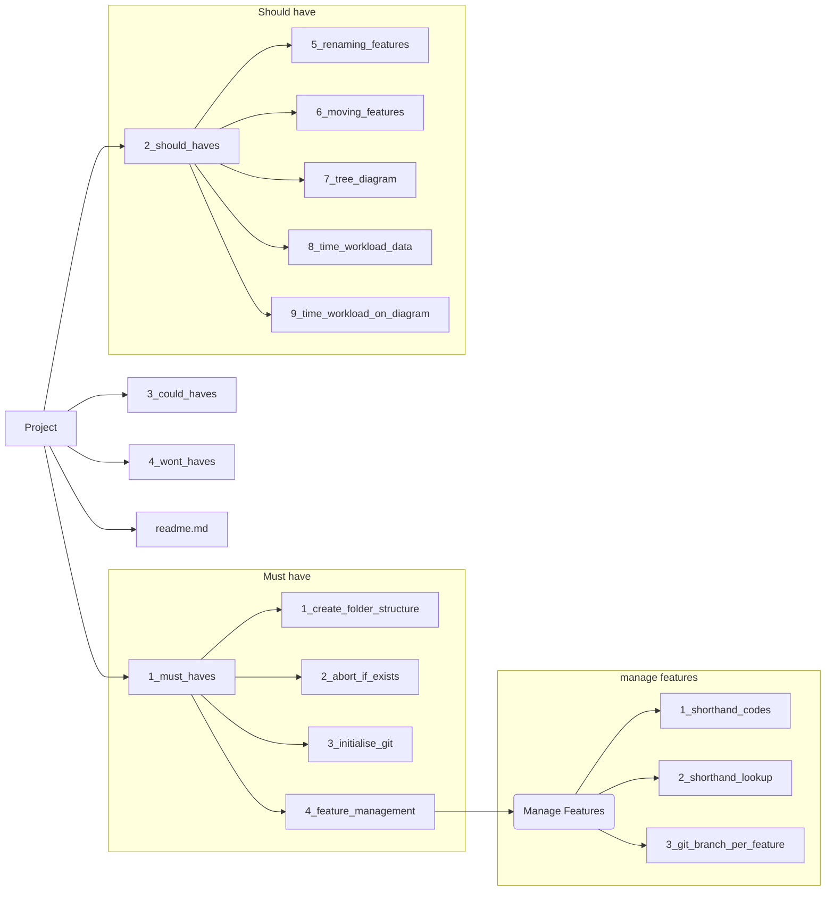

# Coursework 2 Project Planning exercise

Planning is the keystone of successful programming, but it need not all be dry paperwork.  The idea of experimenting with code in a series of feasibility studies can really help identify which approach to take.

In this exercise, you have some thinking to do, and you should get together with others in your peer group (other students) to discuss ideas.

First, though, grab a copy of this project by going to it on CSGitLab and using the "Fork" button near the top right corner.

Please set your version of the project to "private" after forking.

## Goals 

Identify the key goals you need to complete for the coursework

1. Being able to write functions in different files 
1. The different functions should be able to call on each other when needed
1. All the 'musts' should be completed for the Project
1. Having good practices throughout my code - eg. using seperate files instead of writing my code in one large file
1. Using Plantuml - I would need to use plantuml in order to get high marks so learning about that would be very helpful

## Requirements to fulfill goals

What do you need to be able to meet those goals?  This can include clearer specifications, tests (what needs testing, how to test it?), knowledge etc.

1. Testing code that i have written - week7 tests, giving in test data and reviewing the outcome
1. Following the specifications - I would need to follow the specification and create the project as intended
1. More knowlege about linking files together - This project works with different files and i would need to be able to link them together 
1. Learning about new software - Plantuml is a piece of software that i haven't used before so learning about it would be very helpful 
1. Learning about good practices - Learning about good practices would make my code easier to write,read and modify

## Dependencies (mapping goals/requirements etc)

Which requirements relate to which goals - think about drawing out a Product Breakdown for the coursework

1. moving tags depends on finding tags  
1. creating a git repository depends on creating a project
1. the wizard depends on every other function that will be created
1. creating a plantuml file will depend on finding and locating folders/directories
1. renaming files will depend on creating files/projects

_**Hint**_: This might look something like this:

## Plan:

### What experimental code can I write now? (feasibility studies)

1. Creating directory - creating feature 
1. git directory - creating git repository 
1. the main file - pm.c
1. renaming files - renaming features
1. Trying to recursivly look through a directory 

_**Hint**_: try modifying the make file created in week4, consider the code in the videos for ideas about automating your code build, and the video on restucturing your project folder, for instance.

### What were the results of trying things out?

1. Using the system function is the easiest way of creating directories 
1. using the system funciton and then passing in the bash command for git produced a repository. However, i would need to create a .md file and then push it in order to push other items to the remote repository
1. the bash 'mv' function was useful for renaming files
1. you could look into directories through recursion or itteration 
1. i can link files through header files which is useful for pm.c
